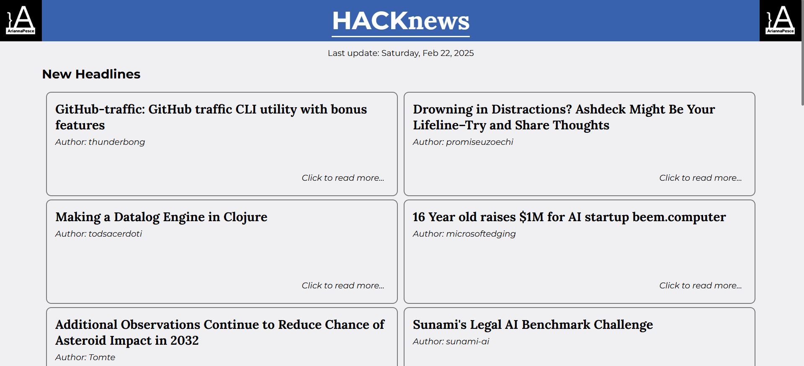

        <h1>HACKnews | A Javascript project</h1>   

 

  <a href="#description">Description</a> •
  <a href="#main-features">Main features</a> •
  <a href="#technologies-used">Technologies used</a> •
  <a href="#contact">Contact</a>

 

# The Laser Space Game

## Description  

**HACKnews** is a web app that gathers the latest tech news using the Hacker News API. Developed by Arianna Pesce as part of the Front-End Development course at start2impact University.

Visit the site:
[HACKnews Website](https://hecknews-arianna-pesce.web.app/)

---  

## Main Features  

- **Dynamic News Load**: Load more than 10 news articles at a time by clicking the '+' button at the bottom of the page.
- **Advertisements**: Like most news websites, HACKnews includes its own advertisements.
- **Hacker News API**: Fetches the latest tech news via the Hacker News API to keep content fresh and up-to-date.
- **Responsive Design**: Compatible with mobile and desktop devices.  

---  

## Technologies Used  

- **HTML**: For the game structure.  
- **CSS**: For styling and animations.  
- **JavaScript**: For logic and interactions.  
- **Axios**: API connection.
- **Lodash**

---  

## Contact

> GitHub [@pescearianna](https://github.com/pescearianna) &nbsp;&middot;&nbsp;
> LinkedIn [Arianna Pesce](https://www.linkedin.com/in/ariannapesce/)

---
